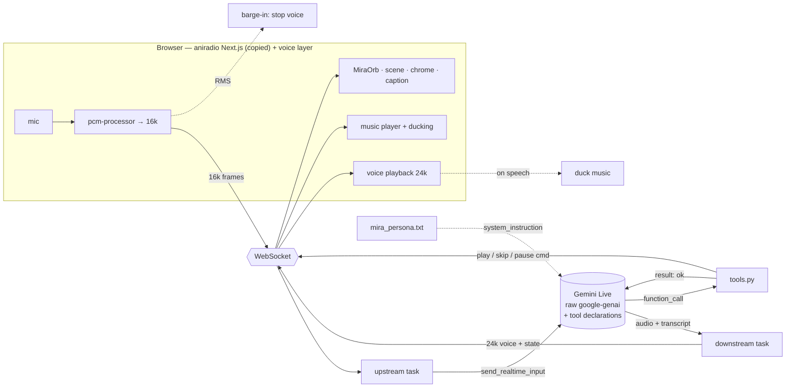

# live-dj — Engineering Design Doc

**Author:** cuppibla
**Status:** Draft v0.2
**Last updated:** 2026-06-06
**Reviewers:** —

---

## 1. Summary

A small **Python** backend (FastAPI + raw `google-genai`) bridges a browser to a **Gemini Live** session — no agent framework. Per connection it runs two `asyncio` tasks (mic up, audio/events down). The agent both **talks** and **controls music**: a few **function-calling tools** (`play_playlist`, `play_track`, `skip`, `pause`) are declared in the live config; a tool call runs a tiny handler that pushes a "play X" command to the browser and **returns instantly**. The **frontend is a copy of aniradio's Next.js room** (Mira's bedroom-pop scene: `MiraOrb`, the scene, the broadcast chrome) wired to this backend, plus a thin **voice layer** (mic→16 kHz worklet, 24 kHz playback, barge-in, the orb's new listening/thinking states, a caption overlay, and a tool-driven music player with ducking). Two interesting choices: tools on the **raw SDK** (function calling is a Live-API primitive, not an ADK feature), and **reusing aniradio's frontend** so the [listening-room.md](listening-room.md) aesthetic is inherited, not re-built. The tightest constraint: live function calls are **synchronous**, so every tool must return without blocking or the voice stalls.

## 2. Assumptions

- **Target scale:** one user, local dev.
- **Latency budget:** first audio ~200ms; barge-in < 200ms (client-detected); a music tool returns in < ~20ms (it only posts a command).
- **Platform:** desktop Chrome/Safari + Python 3.11+, same machine. Frontend is Next.js (a build step — accepted, see §8).
- **Cost ceiling:** the user's own Gemini key; tracks are bundled MP3s.
- **Out of scope:** multi-user, deploy, persistence, ADK.

## 3. Goals & non-goals

**Goals (Phase 1):**
- Hold a real spoken conversation with Mira, in **aniradio's exact look** (listening-room aesthetic, reused — not approximated).
- **Control the music by voice** (play a vibe / track / skip / pause), playing + ducking under her voice.
- **Tools never stall the voice:** every function call returns instantly.
- Barge-in feels instant (client-side, < 200ms).
- The `send_client_content` failure stays reproducible.

**Non-goals (Phase 1):**
- **No ADK** — tools run on the raw SDK; the ADK rebuild is Phase 2 (EP3).
- **No playlist *generation*** — curate aniradio's existing tracks (Lyria is far too slow for a live turn).
- **No persistence / scale / auth.** Single local user, key in `.env`.
- **No re-designed UI** — we inherit aniradio's, we don't invent.

## 4. Architecture



**What's here:**
- **`backend/raw_server.py`** — WS endpoint; owns the Live session, the two tasks, dispatches function calls to `tools.py`.
- **`backend/tools.py`** — the music-control functions; each emits a "play X" command + returns an instant `{ok}`.
- **`backend/persona.py`** — Mira's system instruction.
- **`frontend/`** — **a copy of aniradio's Next.js app** (Mira's room) + a voice layer: the `pcm-processor` worklet, mic/playback/barge-in hooks, the WS client, the orb's new states, the caption overlay, and the tool-driven music player + ducking.
- **`assets/`** — `tracks.json` + the bundled MP3s (copied from aniradio).

**What's deliberately NOT here:**
- **No ADK / LiveRequestQueue** — the raw `session` loop *and* raw function calling ARE the lesson.
- **No database** — the catalog is a static JSON; nothing written at runtime.
- **No new UI / design system** — inherited from aniradio (listening-room.md).
- **No server-side audio mixing** — voice and music are separate browser streams; the server never touches music bytes.

## 5. Key components

### `backend/raw_server.py`
- **Responsibility:** bridge one browser to one Live session; route audio + dispatch tool calls.
- **Tech:** FastAPI + `google-genai` (`client.aio.live.connect` with `tools=[...]`).
- **Interface:** `WS /ws` — binary PCM + JSON up; binary voice + JSON (transcript/state/**play command**) down.

### `backend/tools.py`
- **Responsibility:** the music-control functions the model can call.
- **Tech:** plain Python functions declared as function declarations.
- **Interface (each returns instantly, no `await` on playback):** `play_playlist(mood)`, `play_track(title)`, `skip()`, `pause()` → `{"ok": true}` + a `play` command to the client.

### `frontend/` — **copied from aniradio (Next.js / React), extended**
- **Responsibility:** the room UI + the voice layer.
- **Reused from aniradio (copied, original untouched):** `MiraOrb`, `BedroomPopScene`, the broadcast chrome (top/bottom bars, NEXT/THEN ticker), the canvas/typography — the entire listening-room aesthetic.
- **New (the voice layer):** `pcm-processor.js` (AudioWorklet, mic → 16k + RMS) · a WS client hook · 24 kHz scheduled playback · client-side barge-in · the orb's **`listening`/`thinking`** states (extending `MiraOrb`'s `idle`/`speaking`) · the **caption overlay** for Mira's words · a music player that obeys `play` commands + **ducks** under her voice.
- **Why React/Next, not vanilla:** see §8.

### `backend/gotcha_send_client_content.py`
- The deliberately-wrong loop (mic audio via `send_client_content`) — kept runnable so the EP1 failure is real on camera.

## 6. Data model

No runtime database. One static catalog + bundled audio, copied from aniradio:

```json
// tracks.json
[ { "id": "bp-03", "title": "porcelain mornings", "mood": "dream pop", "file": "tracks/bp-03.mp3" } ]
```

```python
# the function-call surface the model sees
play_playlist(mood: str)   # "dream pop" | "lofi" | ... → start that vibe
play_track(title: str)     # a specific track
skip(); pause()
```

**Notes:** catalog read-only and bundled; no PII stored; mic audio goes to Google's Live API, not recorded locally; MP3s + the room components are aniradio's, **copied** (original repo untouched).

## 7. API surface (the WebSocket contract)

### `WS /ws`
- **Client → server:** **binary** 16 kHz mono PCM (mic, silence included) · **JSON** `{"type":"start"|"stop"}`.
- **Server → client:** **binary** 24 kHz PCM (voice) · **JSON** `{"type":"transcript",...}` · `{"type":"state","value":"listening"|"thinking"|"speaking"}` · **`{"type":"play","action":"playlist"|"track"|"skip"|"pause","value":...}`** · `{"type":"interrupted"}` · `{"type":"error",...}`.
- **Internal call graph:** model `function_call` → `tools.py` → emits a `play` message **and** returns `{ok}` in the same tick (no `await` on playback).
- **Latency budget:** first voice ~200ms after a pause; `play` on screen within ~50ms of the tool call; barge-in client-side.

## 8. Key trade-offs (with rejected alternatives)

### Decision: copy aniradio's Next.js frontend, NOT build vanilla
- **Chose:** copy aniradio's room components (Next.js/React) and wire them to this backend.
- **Considered:** a from-scratch vanilla-JS page (zero build, most forkable).
- **Why we picked this:** the UX must match aniradio *exactly* (listening-room.md). aniradio's components already implement the whole aesthetic — orb, scene, chrome, canvas. Vanilla would mean re-implementing the design system by hand and never quite matching. We accept a **build step** (Next.js) and a **heavier clone**. The **forkable lesson** stays the Python backend loop (small, generic); the frontend is the *demo*, not the starter.

### Decision: tools on the raw SDK, not ADK
- **Chose:** function declarations in the Live config, dispatched in `raw_server.py`.
- **Considered:** ADK's tools + `before_tool_callback`.
- **Why:** function calling is a *Live-API* primitive; raw proves it. **Swap path:** frontend + WS contract stay fixed; Phase 2 swaps only the backend.

### Decision: tools return instantly (fire-and-forget the play command)
- **Chose:** post a `play` message and return `{ok}` immediately.
- **Considered:** await "music is playing" before returning.
- **Why:** live function calls are **synchronous** — the voice pauses until the tool returns. Awaiting would stall it. "ok" is optimistic by design. *(The EP1 lesson, concrete.)*

### Decision: a Live native voice, not Mira's Chirp voice
- **Chose:** a Gemini Live native voice (`speech_config`), picked for warmth.
- **Considered:** matching `Chirp3-HD-Leda` / an ElevenLabs clone.
- **Why:** Live native audio can't use Chirp/ElevenLabs — its own set only. Persona carries the character; timbre changes. A real TTS→Live trade-off.

### Decision: curate existing tracks, not generate
- **Chose:** play aniradio's bundled MP3s. **Considered:** generate (Lyria). **Why:** Lyria is ~60–110s/track — impossible for a live "play now."

*(Also: API key not Vertex; client-side barge-in not server-VAD-only.)*

## 9. Risks & unknowns

- **A blocking tool stalls the voice** — *high if done wrong* — *Mitigation:* the instant-return rule; a unit test that fails if a handler awaits.
- **The AI mistake may not reproduce** — *high* — *Mitigation:* the de-risk run.
- **Echo / feedback** — *high on speakers* (worse with music out loud) — *Mitigation:* headphones in Phase 1; AEC later.
- **Ducking glitches** — *med* — *Mitigation:* duck on the first voice chunk, restore on `state:listening`.
- **Coupling to aniradio's components** — *med* — copying drags in aniradio's Next.js/Tailwind setup; *Mitigation:* copy only the room (orb/scene/chrome), not the generation pipeline or the lobby.
- **Model deprecation** — *med* — pin `gemini-3.1-flash-live-preview`.

## 10. Testing strategy

**Unit (must have):**
- `tools.py` — each function returns the expected `play` command + `{ok}` **synchronously** (fails if a handler becomes `async`/awaits).
- `persona.py` — loads a non-empty instruction; clear error if missing.
- PCM framing — Float32 → 16-bit PCM: even length, correct endianness.
- WS codec — `transcript`/`state`/`play`/`error` JSON round-trips.

**Integration (one happy path):**
- **Tool dispatch (mocked model):** a fake session yields `function_call: play_playlist("lofi")`; assert a `play` reaches the client **and** an `{ok}` goes back, non-blocking. Function-call level — **no browser automation.**

**Deliberately not tested:** the live conversation (manual, de-risk run); Mira's response content; UI / animation / ducking feel (perceptual); aniradio's copied components (already shipped).

**Stack:** Python → `pytest` in `tests/`. Frontend has no unit tests in Phase 1 (it's copied + perceptual). No E2E/Playwright.

## 11. Rollout & monitoring

- **Rollout:** a starter repo, not a service — the de-risk run on the author's machine, then publish with EP1.
- **Monitoring:** local logs — first-audio timing, **tool-call → play-command latency**, session errors. Signal that matters: "does it talk *and* change the music," human-confirmed.
- **Rollback:** delete the branch.

## 12. Cost & capacity

- **Per-user cost:** the user's Gemini key (Live audio minutes); MP3s bundled, no generation cost.
- **At "v1 scale":** author + a handful of local runners — negligible; each pays their own key.
- **What breaks at 10× concurrent:** one process holding N sessions saturates — Phase 1 is single-user by design.

## 13. Open questions

- [ ] Closest Live native voice for Mira? — **owner:** author
- [ ] Tool set: `play_playlist`+`skip` only, or the full four? — **owner:** author + UX
- [ ] How much of aniradio's frontend to copy (just the room, or the player chrome too)? — **owner:** author
- [ ] Does `send_client_content` still reproduce on current models? — **owner:** author

## 14. Out of scope (will not do)

- **No ADK / LiveRequestQueue** — Phase 2 (EP3); raw SDK now, tools included.
- **No playlist generation** — curate bundled tracks only.
- **No memory / persistence** — no DB, no sessions service. Later episode.
- **No new UI** — inherit aniradio's (listening-room.md).
- **No deploy / multi-user / auth / mobile** — local, single user.
